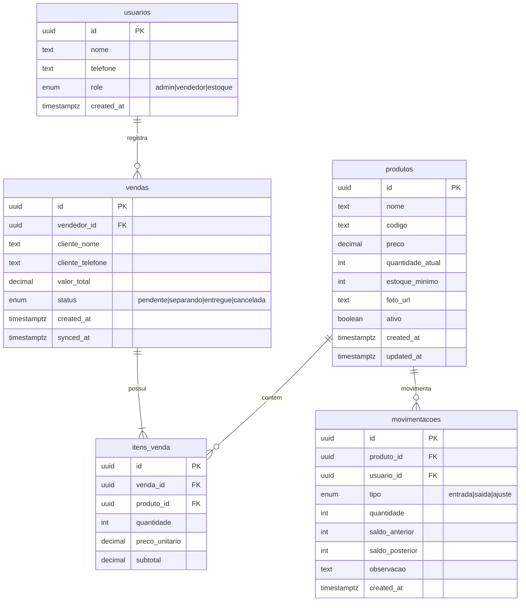
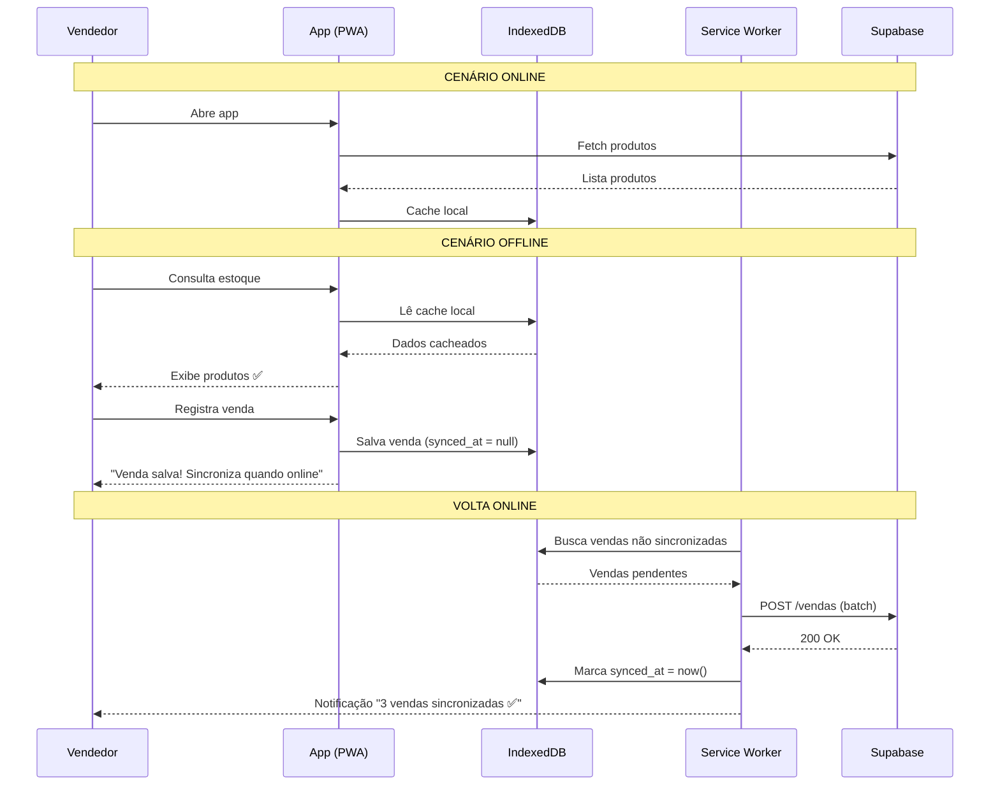

# 🏗️ Arquitetura Técnica - Limpeza Express

> **Cliente:** Ricardo - Limpeza Express
> **Data:** 2026-01-20
> **Stack:** React + Supabase + PWA (Offline-First)

---

## 1. Stack Tecnológica

| Camada | Tecnologia | Justificativa |
|--------|------------|---------------|
| **Frontend** | React 18 + Vite | Performance + Hot Reload |
| **UI** | TailwindCSS + Shadcn/UI | Utility-first + Componentes prontos |
| **Backend** | Supabase (Postgres 15) | BaaS completo + Realtime |
| **Auth** | Supabase Auth | Magic Link (sem senha!) |
| **Offline** | PWA + IndexedDB | Funciona sem internet |
| **Sync** | Service Worker + Background Sync | Sincronização inteligente |

---

## 2. Modelo de Dados

### 2.1 Diagrama ER



### 2.2 Tabelas Detalhadas

#### `usuarios`
| Coluna | Tipo | Descrição |
|--------|------|-----------|
| id | uuid | PK, default gen_random_uuid() |
| nome | text | Nome do usuário |
| telefone | text | WhatsApp (login) |
| role | enum | 'admin' \| 'vendedor' \| 'estoque' |
| created_at | timestamptz | Data criação |

#### `produtos`
| Coluna | Tipo | Descrição |
|--------|------|-----------|
| id | uuid | PK |
| nome | text | Nome do produto |
| codigo | text | Código interno/barras |
| preco | decimal(10,2) | Preço de venda |
| quantidade_atual | int | Estoque atual |
| estoque_minimo | int | Alerta quando < este valor |
| foto_url | text | URL da foto (Supabase Storage) |
| ativo | boolean | Produto ativo? |

#### `vendas`
| Coluna | Tipo | Descrição |
|--------|------|-----------|
| id | uuid | PK |
| vendedor_id | uuid | FK → usuarios |
| cliente_nome | text | Nome do cliente |
| cliente_telefone | text | WhatsApp do cliente |
| valor_total | decimal(10,2) | Soma dos itens |
| status | enum | Fluxo da venda |
| synced_at | timestamptz | Null = não sincronizado |

#### `movimentacoes`
| Coluna | Tipo | Descrição |
|--------|------|-----------|
| id | uuid | PK |
| tipo | enum | 'entrada' \| 'saida' \| 'ajuste' |
| quantidade | int | Quantidade movimentada |
| saldo_anterior | int | Snapshot antes |
| saldo_posterior | int | Snapshot depois |

---

## 3. SQL de Criação

```sql
-- Enum types
CREATE TYPE user_role AS ENUM ('admin', 'vendedor', 'estoque');
CREATE TYPE venda_status AS ENUM ('pendente', 'separando', 'entregue', 'cancelada');
CREATE TYPE mov_tipo AS ENUM ('entrada', 'saida', 'ajuste');

-- Tabela: usuarios
CREATE TABLE usuarios (
    id UUID PRIMARY KEY DEFAULT gen_random_uuid(),
    nome TEXT NOT NULL,
    telefone TEXT UNIQUE NOT NULL,
    role user_role NOT NULL DEFAULT 'vendedor',
    created_at TIMESTAMPTZ DEFAULT NOW()
);

-- Tabela: produtos
CREATE TABLE produtos (
    id UUID PRIMARY KEY DEFAULT gen_random_uuid(),
    nome TEXT NOT NULL,
    codigo TEXT UNIQUE,
    preco DECIMAL(10,2) NOT NULL DEFAULT 0,
    quantidade_atual INT NOT NULL DEFAULT 0 CHECK (quantidade_atual >= 0),
    estoque_minimo INT NOT NULL DEFAULT 5,
    foto_url TEXT,
    ativo BOOLEAN DEFAULT true,
    created_at TIMESTAMPTZ DEFAULT NOW(),
    updated_at TIMESTAMPTZ DEFAULT NOW()
);

-- Tabela: vendas
CREATE TABLE vendas (
    id UUID PRIMARY KEY DEFAULT gen_random_uuid(),
    vendedor_id UUID REFERENCES usuarios(id),
    cliente_nome TEXT NOT NULL,
    cliente_telefone TEXT,
    valor_total DECIMAL(10,2) NOT NULL DEFAULT 0,
    status venda_status NOT NULL DEFAULT 'pendente',
    created_at TIMESTAMPTZ DEFAULT NOW(),
    synced_at TIMESTAMPTZ -- NULL = criado offline, aguardando sync
);

-- Tabela: itens_venda
CREATE TABLE itens_venda (
    id UUID PRIMARY KEY DEFAULT gen_random_uuid(),
    venda_id UUID REFERENCES vendas(id) ON DELETE CASCADE,
    produto_id UUID REFERENCES produtos(id),
    quantidade INT NOT NULL CHECK (quantidade > 0),
    preco_unitario DECIMAL(10,2) NOT NULL,
    subtotal DECIMAL(10,2) GENERATED ALWAYS AS (quantidade * preco_unitario) STORED
);

-- Tabela: movimentacoes
CREATE TABLE movimentacoes (
    id UUID PRIMARY KEY DEFAULT gen_random_uuid(),
    produto_id UUID REFERENCES produtos(id),
    usuario_id UUID REFERENCES usuarios(id),
    tipo mov_tipo NOT NULL,
    quantidade INT NOT NULL,
    saldo_anterior INT NOT NULL,
    saldo_posterior INT NOT NULL,
    observacao TEXT,
    created_at TIMESTAMPTZ DEFAULT NOW()
);

-- Trigger: Atualizar updated_at
CREATE OR REPLACE FUNCTION update_updated_at()
RETURNS TRIGGER AS $$
BEGIN
    NEW.updated_at = NOW();
    RETURN NEW;
END;
$$ LANGUAGE plpgsql;

CREATE TRIGGER produtos_updated_at
    BEFORE UPDATE ON produtos
    FOR EACH ROW
    EXECUTE FUNCTION update_updated_at();

-- Trigger: Registrar movimentação automática na venda
CREATE OR REPLACE FUNCTION registrar_saida_venda()
RETURNS TRIGGER AS $$
BEGIN
    -- Atualiza estoque do produto
    UPDATE produtos 
    SET quantidade_atual = quantidade_atual - NEW.quantidade
    WHERE id = NEW.produto_id;
    
    -- Registra movimentação
    INSERT INTO movimentacoes (produto_id, usuario_id, tipo, quantidade, saldo_anterior, saldo_posterior, observacao)
    SELECT 
        NEW.produto_id,
        v.vendedor_id,
        'saida',
        NEW.quantidade,
        p.quantidade_atual + NEW.quantidade,
        p.quantidade_atual,
        'Venda #' || NEW.venda_id::text
    FROM produtos p, vendas v
    WHERE p.id = NEW.produto_id AND v.id = NEW.venda_id;
    
    RETURN NEW;
END;
$$ LANGUAGE plpgsql;

CREATE TRIGGER item_venda_saida
    AFTER INSERT ON itens_venda
    FOR EACH ROW
    EXECUTE FUNCTION registrar_saida_venda();

-- Índices para performance
CREATE INDEX idx_produtos_ativo ON produtos(ativo) WHERE ativo = true;
CREATE INDEX idx_vendas_status ON vendas(status);
CREATE INDEX idx_vendas_synced ON vendas(synced_at) WHERE synced_at IS NULL;
CREATE INDEX idx_movimentacoes_produto ON movimentacoes(produto_id, created_at DESC);
```

---

## 4. Políticas RLS (Row Level Security)

```sql
-- Habilitar RLS em todas as tabelas
ALTER TABLE usuarios ENABLE ROW LEVEL SECURITY;
ALTER TABLE produtos ENABLE ROW LEVEL SECURITY;
ALTER TABLE vendas ENABLE ROW LEVEL SECURITY;
ALTER TABLE itens_venda ENABLE ROW LEVEL SECURITY;
ALTER TABLE movimentacoes ENABLE ROW LEVEL SECURITY;

-- Produtos: Todos podem ler, apenas admin pode modificar
CREATE POLICY "Produtos visíveis para todos" ON produtos
    FOR SELECT USING (true);

CREATE POLICY "Apenas admin modifica produtos" ON produtos
    FOR ALL USING (
        EXISTS (
            SELECT 1 FROM usuarios 
            WHERE id = auth.uid() AND role = 'admin'
        )
    );

-- Vendas: Vendedor vê apenas suas vendas, admin vê todas
CREATE POLICY "Vendedor vê suas vendas" ON vendas
    FOR SELECT USING (
        vendedor_id = auth.uid() OR
        EXISTS (SELECT 1 FROM usuarios WHERE id = auth.uid() AND role = 'admin')
    );

CREATE POLICY "Vendedor cria vendas" ON vendas
    FOR INSERT WITH CHECK (vendedor_id = auth.uid());

-- Estoque: Apenas role 'estoque' e 'admin' podem alterar status
CREATE POLICY "Estoque atualiza status" ON vendas
    FOR UPDATE USING (
        EXISTS (
            SELECT 1 FROM usuarios 
            WHERE id = auth.uid() AND role IN ('estoque', 'admin')
        )
    );
```

---

## 5. Estratégia Offline-First 🔌

### 5.1 O Problema
> **Cenário:** Vendedor está em área sem sinal. Precisa consultar estoque e registrar venda.

### 5.2 Solução: PWA + IndexedDB + Background Sync



### 5.3 Implementação Técnica

#### Service Worker (sw.js)
```javascript
// Estratégia: Cache-First para produtos
self.addEventListener('fetch', (event) => {
  if (event.request.url.includes('/produtos')) {
    event.respondWith(
      caches.match(event.request).then((cached) => {
        return cached || fetch(event.request).then((response) => {
          const clone = response.clone();
          caches.open('produtos-v1').then((cache) => {
            cache.put(event.request, clone);
          });
          return response;
        });
      })
    );
  }
});

// Background Sync para vendas offline
self.addEventListener('sync', (event) => {
  if (event.tag === 'sync-vendas') {
    event.waitUntil(syncPendingVendas());
  }
});

async function syncPendingVendas() {
  const db = await openDB('limpeza-express', 1);
  const pendentes = await db.getAll('vendas-offline');
  
  for (const venda of pendentes) {
    try {
      await fetch('/api/vendas', {
        method: 'POST',
        body: JSON.stringify(venda)
      });
      await db.delete('vendas-offline', venda.id);
    } catch (e) {
      console.log('Sync falhou, tentará novamente');
    }
  }
}
```

#### Hook React (useOfflineVenda.ts)
```typescript
export function useOfflineVenda() {
  const isOnline = useOnlineStatus();
  
  async function registrarVenda(venda: Venda) {
    if (isOnline) {
      // Envia direto para Supabase
      return supabase.from('vendas').insert(venda);
    } else {
      // Salva no IndexedDB
      const db = await openDB('limpeza-express', 1);
      await db.add('vendas-offline', { ...venda, synced_at: null });
      
      // Agenda sync quando voltar online
      await navigator.serviceWorker.ready;
      await registration.sync.register('sync-vendas');
      
      return { success: true, offline: true };
    }
  }
  
  return { registrarVenda, isOnline };
}
```

### 5.4 Indicador Visual de Status

```
┌─────────────────────────────┐
│ 🟢 Online - Sincronizado    │  ← Verde: tudo OK
│ 🟡 Offline - 2 vendas pend. │  ← Amarelo: tem pendências
│ 🔴 Erro de sincronização    │  ← Vermelho: falha
└─────────────────────────────┘
```

---

## 6. UX/UI Guidelines - Mobile First

### 6.1 Princípios Core

| Princípio | Implementação |
|-----------|---------------|
| **Thumb Zone** | Botões principais no terço inferior |
| **Botões Gigantes** | Mínimo 56px de altura |
| **Feedback Exagerado** | Tela cheia verde + vibração + som |
| **Zero Scroll** | Informações críticas acima da dobra |

### 6.2 Componentes de Feedback

#### Sucesso (Tela Cheia)
```tsx
<SuccessOverlay>
  <CheckCircle size={120} className="text-white animate-bounce" />
  <h1 className="text-4xl font-bold text-white">VENDA REGISTRADA!</h1>
  <p className="text-white/80">Sincroniza automaticamente</p>
</SuccessOverlay>
```

#### Botão de Ação Principal
```tsx
<Button 
  className="w-full h-16 text-xl font-bold bg-green-600 hover:bg-green-700"
  onClick={handleVenda}
>
  ✅ CONFIRMAR VENDA
</Button>
```

### 6.3 Cores do Sistema

| Estado | Cor | Hex | Uso |
|--------|-----|-----|-----|
| Sucesso | Verde | #16A34A | Confirmações, estoque OK |
| Alerta | Amarelo | #EAB308 | Estoque baixo, offline |
| Erro | Vermelho | #DC2626 | Sem estoque, falha |
| Neutro | Azul | #2563EB | Links, loading |

### 6.4 Skeleton Loading
```tsx
// Enquanto carrega produtos
<div className="animate-pulse space-y-4">
  <div className="h-20 bg-gray-200 rounded-lg" />
  <div className="h-20 bg-gray-200 rounded-lg" />
  <div className="h-20 bg-gray-200 rounded-lg" />
</div>
```

---

## 7. Arquitetura de Pastas (Frontend)

```
src/
├── app/
│   ├── (auth)/
│   │   └── login/
│   ├── (vendedor)/
│   │   └── catalogo/
│   ├── (estoque)/
│   │   └── baixa/
│   └── (admin)/
│       └── dashboard/
├── components/
│   ├── ui/           # Shadcn components
│   ├── feedback/     # SuccessOverlay, ErrorToast
│   └── offline/      # SyncStatus, OfflineBanner
├── hooks/
│   ├── useProducts.ts
│   ├── useVendas.ts
│   ├── useOfflineVenda.ts
│   └── useOnlineStatus.ts
├── lib/
│   ├── supabase.ts
│   └── indexeddb.ts
└── sw.js             # Service Worker
```

---

## 8. Integrações Futuras

| Integração | Prioridade | Ciclo |
|------------|------------|-------|
| WhatsApp Notificações | Alta | Ciclo 2 |
| Leitor Código de Barras | Média | Ciclo 2 |
| Push Notifications | Média | Ciclo 2 |
| Supabase Realtime | Baixa | Ciclo 3 |

---
*Gerado por CodeSprint AI Architect*
