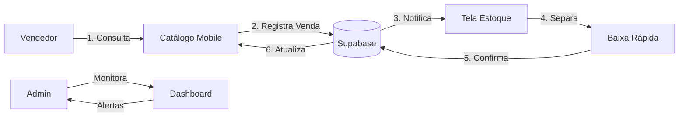

# 🗺️ Mapa de Funcionalidades - Limpeza Express

> **Cliente:** Ricardo - Limpeza Express
> **Data:** 2026-01-20
> **Ciclo Shape Up:** 12 dias

---

## 1. Visão Geral

### 1.1 Problema a Resolver
**Vendas cegas + Ruptura de estoque** → Vendedores não sabem o que tem disponível, gerando cancelamentos e perda de clientes.

### 1.2 Métrica de Sucesso
| KPI | Antes | Meta |
|-----|-------|------|
| Vendas canceladas por ruptura | ~25/mês | < 5/mês |
| Tempo de resposta ao cliente | > 5 min | < 30 seg |
| Acurácia do estoque | ~60% | > 95% |

---

## 2. Fatia Fina (MVP) - 3 Telas que Resolvem 80%

### 📱 Tela 1: Catálogo Mobile de Vendas
**Objetivo:** Vendedor sabe instantaneamente o que tem disponível
**Usuário:** Vendedor em campo (WhatsApp)
**Funcionalidades:**
- [x] Lista de produtos com foto e preço
- [x] **Indicador visual de disponibilidade** (Verde/Amarelo/Vermelho)
- [x] Busca rápida por nome ou código
- [x] Botão "Registrar Venda" com quantidade
- [x] **Funciona OFFLINE** (sincroniza quando voltar online)

**UX Crítica:**
```
┌─────────────────────────────┐
│ 🔍 Buscar produto...        │
├─────────────────────────────┤
│ ┌───┐ Desinfetante 5L       │
│ │ 📦│ R$ 25,00              │
│ └───┘ 🟢 45 unid            │
│       [VENDER]              │
├─────────────────────────────┤
│ ┌───┐ Água Sanitária 2L     │
│ │ 📦│ R$ 8,00               │
│ └───┘ 🟡 8 unid             │
│       [VENDER]              │
├─────────────────────────────┤
│ ┌───┐ Detergente 500ml      │
│ │ 📦│ R$ 3,50               │
│ └───┘ 🔴 0 unid             │
│       [SEM ESTOQUE]         │
└─────────────────────────────┘
```

---

### 📊 Tela 2: Dashboard de Estoque (Admin)
**Objetivo:** Dono/Gerente tem visão completa do estoque
**Usuário:** Ricardo (Dono) + Gerente
**Funcionalidades:**
- [x] Listagem de todos os produtos com quantidades
- [x] **Alertas de estoque baixo** (push notification)
- [x] Histórico de movimentações (entrada/saída)
- [x] Botão "Dar Entrada" para abastecer estoque
- [x] Relatório simples: mais vendidos, parados

**UX Crítica:**
```
┌─────────────────────────────┐
│ 📊 ESTOQUE LIMPEZA EXPRESS  │
├─────────────────────────────┤
│ ⚠️ 3 produtos em alerta     │
│ [VER ALERTAS]               │
├─────────────────────────────┤
│ Total Produtos: 47          │
│ Valor em Estoque: R$ 8.450  │
├─────────────────────────────┤
│ 🔥 MAIS VENDIDOS            │
│ 1. Desinfetante 5L (120/mês)│
│ 2. Água Sanitária (98/mês)  │
├─────────────────────────────┤
│ 💤 PARADOS (>30 dias)       │
│ 1. Cera Líquida (0 vendas)  │
└─────────────────────────────┘
```

---

### ⬇️ Tela 3: Baixa Rápida (Estoque)
**Objetivo:** Rapaz do estoque confirma saída de produtos
**Usuário:** Funcionário do estoque/expedição
**Funcionalidades:**
- [x] Lista de vendas pendentes de separação
- [x] **Botão gigante "SEPARADO"** (thumb-friendly)
- [x] Confirmação visual exagerada (tela verde + som)
- [x] Scan de código de barras (futuro)

**UX Crítica:**
```
┌─────────────────────────────┐
│ 📦 SEPARAR PEDIDOS          │
├─────────────────────────────┤
│ Pedido #142 - João Silva    │
│ • 2x Desinfetante 5L        │
│ • 5x Detergente 500ml       │
│ ┌─────────────────────────┐ │
│ │                         │ │
│ │   ✅ SEPARADO           │ │
│ │                         │ │
│ └─────────────────────────┘ │
├─────────────────────────────┤
│ Pedido #143 - Maria Santos  │
│ • 10x Água Sanitária 2L     │
│ ┌─────────────────────────┐ │
│ │                         │ │
│ │   ✅ SEPARADO           │ │
│ │                         │ │
│ └─────────────────────────┘ │
└─────────────────────────────┘
```

---

## 3. Fluxo Completo



---

## 4. Backlog Futuro (Pós-MVP)

| Funcionalidade | Prioridade | Ciclo |
|----------------|------------|-------|
| Integração WhatsApp (Bot) | Alta | Ciclo 2 |
| Scan de código de barras | Média | Ciclo 2 |
| Relatórios financeiros | Média | Ciclo 3 |
| Multi-vendedor (comissões) | Baixa | Ciclo 3 |
| Integração NFe | Baixa | Ciclo 4 |

---

## 5. O Que NÃO Entra no MVP

> **Scope Creep Prevention**

- ❌ Integração com WhatsApp Business API
- ❌ Geração de NFe/NFCe
- ❌ Controle de comissões
- ❌ Multi-empresa
- ❌ Relatórios complexos (BI)

**Justificativa:** O problema central é **visibilidade de estoque**. Tudo que não resolve isso diretamente fica para depois.

---

## 6. Cronograma Shape Up (12 dias)

| Semana | Dias | Entrega |
|--------|------|---------|
| S1 | D1-D3 | Setup projeto + Banco de dados + Auth |
| S1 | D4-D6 | Tela 1: Catálogo Mobile (+ Offline) |
| S2 | D7-D9 | Tela 2: Dashboard Admin |
| S2 | D10-D11 | Tela 3: Baixa Rápida |
| S2 | D12 | Testes + Deploy + Treinamento |

---

## 7. Critérios de Aceite do MVP

- [ ] Vendedor consulta estoque em < 3 segundos
- [ ] App funciona 100% offline
- [ ] Sincronização automática quando online
- [ ] Alerta de estoque baixo chega no WhatsApp do Ricardo
- [ ] Rapaz do estoque dá baixa com 1 clique

---
*Gerado por CodeSprint AI Architect*
