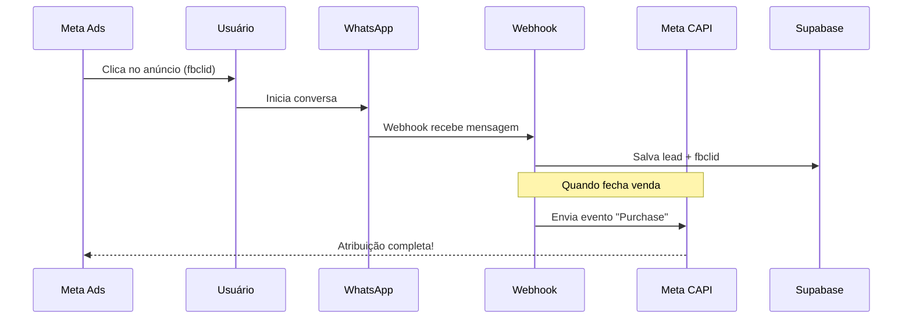

# 📋 Relatório de Viabilidade - Loja do Monstrão

> **Cliente:** Loja do Monstrão
> **Segmento:** Moda Masculina (Varejo + Atacado)
> **Data:** 2026-01-20

---

## 1. Resumo Executivo

| Métrica | Valor |
|---------|-------|
| **Veredito** | 🟢 **GO** |
| **Dor Mensal** | R$ 17.600 (leads perdidos, 22 dias úteis) |
| **Investimento** | R$ 7.000 (setup) + R$ 300/mês |
| **Payback** | < 1 mês (~24 dias) |
| **ROI Ano 1** | **+R$ 95.000** |
| **Risco Técnico** | 🟡 Médio |

---

## 2. Viabilidade Técnica

### 2.1 Integração Meta Conversions API

| Aspecto | Avaliação |
|---------|-----------|
| **Documentação** | ✅ Excelente (Meta bem documentado) |
| **Complexidade** | 🟡 Média (requer App Review) |
| **Tempo estimado** | 3-5 dias |
| **Dependências** | Facebook Business Manager, Pixel ID |

**Como funciona:**


**Eventos que podemos rastrear:**
- `Lead` - Quando inicia conversa
- `InitiateCheckout` - Quando mostra interesse
- `Purchase` - Quando fecha venda
- `AddToCart` - Quando pede mais informações

### 2.2 Agente de IA via WhatsApp

| Aspecto | Avaliação |
|---------|-----------|
| **Stack** | Evolution API + OpenAI GPT-4 |
| **Complexidade** | 🟡 Média |
| **Tempo resposta** | < 30 segundos |
| **Custo OpenAI estimado** | ~R$ 200/mês |

**Fluxo do Agente:**
```
1. Lead envia mensagem
2. Agente responde em < 30s
3. Triagem: Atacado ou Varejo?
4. Coleta: Nome, cidade, interesse
5. Qualificação: Lead quente/morno/frio
6. Handoff: Passa para vendedor humano
```

### 2.3 Dashboard de Atribuição

| Aspecto | Avaliação |
|---------|-----------|
| **Stack** | React + Supabase + Recharts |
| **Complexidade** | 🟢 Baixa |
| **Realtime** | ✅ Supabase Realtime |

**Métricas do Dashboard:**
- Leads por campanha/anúncio
- Taxa de conversão por fonte
- Ticket médio por campanha
- ROI por anúncio (custo vs receita)

### 2.4 CRM Kanban

| Aspecto | Avaliação |
|---------|-----------|
| **Stack** | React DnD + Supabase |
| **Complexidade** | 🟢 Baixa |
| **Funcionalidades** | Drag-and-drop, filtros, tags |

**Estágios do Kanban:**
```
NOVO → QUALIFICADO → NEGOCIANDO → FECHADO → PERDIDO
```

---

## 3. Análise de Riscos

### 3.1 Buracos de Coelho

| Risco | Prob. | Impacto | Mitigação |
|-------|-------|---------|-----------|
| **App Review Meta demorar** | Média | Alto | Usar Business Verification prévia |
| **WhatsApp banir número** | Baixa | Crítico | Usar WhatsApp Business API oficial |
| **IA responder errado** | Média | Médio | Prompts bem definidos + fallback humano |
| **Cliente não usar dashboard** | Média | Baixo | Treinamento + Alertas WhatsApp |
| **fbclid não chegar** | Média | Alto | Fallback: UTM params + referrer |

### 3.2 Dependências Externas

| Dependência | Risco | Plano B |
|-------------|-------|---------|
| Evolution API | Baixo | BailysJS ou Z-API |
| OpenAI API | Baixo | Claude ou Gemini |
| Meta CAPI | Médio | Atribuição manual por UTM |

### 3.3 Estratégia de Fallback (fbclid)

```
CENÁRIO: fbclid não chega no WhatsApp

PROBLEMA: Deep link perde parâmetros

SOLUÇÃO:
1. Usar link intermediário (landing page)
2. Landing captura fbclid + redireciona
3. WhatsApp recebe com referência
4. OU: Perguntar "Onde viu nosso anúncio?"
```

---

## 4. Escopo Técnico Detalhado

### 4.1 MVP (12 dias)

| Módulo | Dias | Entrega |
|--------|------|---------|
| Setup Infra | 2 | Supabase + Evolution + Webhook |
| Agente IA | 3 | Triagem + Qualificação |
| Meta CAPI | 3 | Rastreamento de eventos |
| Dashboard | 2 | Visualização básica |
| CRM Kanban | 2 | Gestão de leads |

### 4.2 Incluso no Setup

- ✅ Agente IA de triagem (< 30s resposta)
- ✅ Integração Meta Conversions API
- ✅ Dashboard de atribuição
- ✅ CRM Kanban
- ✅ Webhook WhatsApp
- ✅ Treinamento (2h)

### 4.3 NÃO Incluso (Fases Futuras)

| Feature | Ciclo | Custo Estimado |
|---------|-------|----------------|
| Catálogo de produtos no WhatsApp | Ciclo 2 | R$ 8.000 |
| Pagamento no chat (PIX) | Ciclo 2 | R$ 6.000 |
| Relatórios BI avançados | Ciclo 3 | R$ 5.000 |
| Multi-atendente | Ciclo 3 | R$ 4.000 |

---

## 5. Veredito Final

### 🟢 **GO - PROJETO APROVADO**

### Justificativa

1. **ROI Sólido:** Payback em menos de 1 mês, +R$ 95.000 no ano 1

2. **Dor Real e Mensurável:** R$ 17.6k/mês evaporando no funil (22 dias úteis)

3. **Stack Madura:** Todas as tecnologias são conhecidas e testadas

4. **Risco Controlável:** Fallbacks para cada dependência externa

5. **Caso de Uso Comum:** Já implementamos soluções similares

### Próximos Passos

| Passo | Responsável | Prazo |
|-------|-------------|-------|
| 1. Apresentar proposta | Danilo | Hoje |
| 2. Facebook Business Verification | Cliente | +3 dias |
| 3. Assinatura + Sinal 50% | Cliente | +5 dias |
| 4. Kick-off + Setup Infra | Dev Team | +7 dias |
| 5. Sprint MVP (12 dias) | Dev Team | +19 dias |
| 6. Go-Live + Treinamento | Dev Team | +20 dias |

---

## 6. Anexos

- [📊 Diagnóstico Financeiro](./dor_financeira.md)
- [🗺️ Mapa de Funcionalidades](../03_solucao/feature_map.md)
- [🏗️ Arquitetura Técnica](../03_solucao/arquitetura.md)

---

> **"Cada clique perdido é R$ 40 jogado fora. Vamos tapar esse buraco."**

*Gerado por CodeSprint AI Architect*
