# 🏗️ Arquitetura Técnica - Loja do Monstrão

> **Cliente:** Loja do Monstrão
> **Data:** 2026-01-20
> **Stack:** React + Supabase + Evolution API + OpenAI

---

## 1. Stack Tecnológica

| Camada | Tecnologia | Justificativa |
|--------|------------|---------------|
| **Frontend** | React 18 + Vite | Performance + Hot Reload |
| **UI** | TailwindCSS + Shadcn/UI | Utility-first |
| **Backend** | Supabase (Postgres 15) | BaaS + Realtime |
| **WhatsApp** | Evolution API | Self-hosted, sem custo por msg |
| **IA** | OpenAI GPT-4o-mini | Custo-benefício para triagem |
| **Atribuição** | Meta Conversions API | Rastreamento server-side |
| **Hosting** | VPS (Ubuntu) | Controle total |

---

## 2. Modelo de Dados

### 2.1 Diagrama ER

```mermaid
erDiagram
    campanhas ||--o{ leads : gera
    leads ||--o{ interacoes : possui
    leads ||--o{ vendas : converte
    vendedores ||--o{ leads : atende
    vendedores ||--o{ vendas : fecha
    
    campanhas {
        uuid id PK
        text nome
        text ad_id
        text adset_id
        text campaign_id
        decimal custo_total
        int cliques
        timestamptz created_at
    }
    
    leads {
        uuid id PK
        uuid campanha_id FK
        uuid vendedor_id FK
        text nome
        text telefone
        text cidade
        enum tipo "atacado|varejo"
        enum status "novo|qualificado|negociando|fechado|perdido"
        enum temperatura "quente|morno|frio"
        text interesse
        text fbclid
        text utm_source
        text utm_campaign
        jsonb context
        timestamptz primeiro_contato
        timestamptz ultimo_contato
        timestamptz created_at
    }
    
    interacoes {
        uuid id PK
        uuid lead_id FK
        enum tipo "mensagem_in|mensagem_out|nota|handoff"
        text conteudo
        text autor
        timestamptz created_at
    }
    
    vendas {
        uuid id PK
        uuid lead_id FK
        uuid vendedor_id FK
        decimal valor
        text produtos
        enum status "pendente|pago|cancelado"
        boolean evento_enviado
        timestamptz created_at
    }
    
    vendedores {
        uuid id PK
        text nome
        text telefone
        boolean ativo
        timestamptz created_at
    }
    
    eventos_meta {
        uuid id PK
        uuid lead_id FK
        text event_name
        text event_id
        jsonb payload
        boolean enviado
        text response
        timestamptz created_at
    }
```



### 2.2 Tabelas SQL

```sql
-- Enum types
CREATE TYPE lead_tipo AS ENUM ('atacado', 'varejo');
CREATE TYPE lead_status AS ENUM ('novo', 'qualificado', 'negociando', 'fechado', 'perdido');
CREATE TYPE lead_temp AS ENUM ('quente', 'morno', 'frio');
CREATE TYPE interacao_tipo AS ENUM ('mensagem_in', 'mensagem_out', 'nota', 'handoff');
CREATE TYPE venda_status AS ENUM ('pendente', 'pago', 'cancelado');

-- Tabela: campanhas (dados do Meta Ads)
CREATE TABLE campanhas (
    id UUID PRIMARY KEY DEFAULT gen_random_uuid(),
    nome TEXT NOT NULL,
    ad_id TEXT,                    -- ID do anúncio no Meta
    adset_id TEXT,                 -- ID do conjunto
    campaign_id TEXT,              -- ID da campanha
    custo_total DECIMAL(10,2) DEFAULT 0,
    cliques INT DEFAULT 0,
    created_at TIMESTAMPTZ DEFAULT NOW()
);

-- Tabela: vendedores
CREATE TABLE vendedores (
    id UUID PRIMARY KEY DEFAULT gen_random_uuid(),
    nome TEXT NOT NULL,
    telefone TEXT UNIQUE NOT NULL,
    ativo BOOLEAN DEFAULT true,
    created_at TIMESTAMPTZ DEFAULT NOW()
);

-- Tabela: leads (core)
CREATE TABLE leads (
    id UUID PRIMARY KEY DEFAULT gen_random_uuid(),
    campanha_id UUID REFERENCES campanhas(id),
    vendedor_id UUID REFERENCES vendedores(id),
    nome TEXT,
    telefone TEXT UNIQUE NOT NULL,
    cidade TEXT,
    tipo lead_tipo,
    status lead_status DEFAULT 'novo',
    temperatura lead_temp DEFAULT 'morno',
    interesse TEXT,
    fbclid TEXT,                   -- Facebook Click ID
    utm_source TEXT,
    utm_campaign TEXT,
    context JSONB DEFAULT '{}',    -- Dados extras da conversa
    primeiro_contato TIMESTAMPTZ DEFAULT NOW(),
    ultimo_contato TIMESTAMPTZ DEFAULT NOW(),
    created_at TIMESTAMPTZ DEFAULT NOW()
);

-- Tabela: interacoes (histórico de conversa)
CREATE TABLE interacoes (
    id UUID PRIMARY KEY DEFAULT gen_random_uuid(),
    lead_id UUID REFERENCES leads(id) ON DELETE CASCADE,
    tipo interacao_tipo NOT NULL,
    conteudo TEXT NOT NULL,
    autor TEXT,                    -- 'bot', 'lead', 'vendedor', 'sistema'
    created_at TIMESTAMPTZ DEFAULT NOW()
);

-- Tabela: vendas
CREATE TABLE vendas (
    id UUID PRIMARY KEY DEFAULT gen_random_uuid(),
    lead_id UUID REFERENCES leads(id),
    vendedor_id UUID REFERENCES vendedores(id),
    valor DECIMAL(10,2) NOT NULL,
    produtos TEXT,
    status venda_status DEFAULT 'pendente',
    evento_enviado BOOLEAN DEFAULT false,  -- Purchase enviado ao Meta?
    created_at TIMESTAMPTZ DEFAULT NOW()
);

-- Tabela: eventos_meta (log de eventos CAPI)
CREATE TABLE eventos_meta (
    id UUID PRIMARY KEY DEFAULT gen_random_uuid(),
    lead_id UUID REFERENCES leads(id),
    event_name TEXT NOT NULL,      -- 'Lead', 'Purchase', etc
    event_id TEXT UNIQUE,          -- ID único para dedupe
    payload JSONB,
    enviado BOOLEAN DEFAULT false,
    response TEXT,
    created_at TIMESTAMPTZ DEFAULT NOW()
);

-- Índices
CREATE INDEX idx_leads_status ON leads(status);
CREATE INDEX idx_leads_telefone ON leads(telefone);
CREATE INDEX idx_leads_campanha ON leads(campanha_id);
CREATE INDEX idx_leads_fbclid ON leads(fbclid) WHERE fbclid IS NOT NULL;
CREATE INDEX idx_interacoes_lead ON interacoes(lead_id, created_at DESC);
CREATE INDEX idx_vendas_lead ON vendas(lead_id);
CREATE INDEX idx_eventos_meta_lead ON eventos_meta(lead_id);

-- Trigger: Atualizar ultimo_contato
CREATE OR REPLACE FUNCTION update_ultimo_contato()
RETURNS TRIGGER AS $$
BEGIN
    UPDATE leads SET ultimo_contato = NOW() WHERE id = NEW.lead_id;
    RETURN NEW;
END;
$$ LANGUAGE plpgsql;

CREATE TRIGGER interacao_atualiza_lead
    AFTER INSERT ON interacoes
    FOR EACH ROW
    EXECUTE FUNCTION update_ultimo_contato();
```

---

## 3. Fluxo do Webhook WhatsApp/Meta

### 3.1 Arquitetura de Fluxo

```mermaid
sequenceDiagram
    autonumber
    participant User as Lead
    participant WA as WhatsApp
    participant EVO as Evolution API
    participant WH as Webhook (Node.js)
    participant AI as OpenAI
    participant DB as Supabase
    participant CAPI as Meta CAPI
    participant META as Meta Ads
    
    Note over User,META: FASE 1: Lead Chega
    User->>WA: Clica no anúncio (fbclid)
    WA->>User: Abre chat
    User->>WA: Envia "Oi"
    WA->>EVO: Webhook de mensagem
    EVO->>WH: POST /webhook/messages
    
    Note over WH,DB: FASE 2: Processa Lead
    WH->>DB: Busca lead pelo telefone
    alt Lead não existe
        WH->>DB: Cria lead com fbclid
        WH->>CAPI: Envia evento "Lead"
        CAPI->>META: Registra conversão
    end
    
    Note over WH,AI: FASE 3: IA Responde
    WH->>AI: Envia contexto + mensagem
    AI-->>WH: Resposta + ação
    WH->>DB: Salva interação
    WH->>EVO: Envia resposta
    EVO->>WA: Mensagem para lead
    WA->>User: Recebe resposta (< 30s)
    
    Note over WH,META: FASE 4: Quando Fecha Venda
    WH->>DB: Registra venda
    WH->>CAPI: Envia evento "Purchase"
    CAPI->>META: Atribuição completa!
```



### 3.2 Estrutura do Webhook

```typescript
// webhook/src/handlers/messageHandler.ts

interface IncomingMessage {
  from: string;          // Telefone do lead
  body: string;          // Texto da mensagem
  timestamp: number;
  pushName?: string;     // Nome do WhatsApp
}

interface LeadContext {
  id: string;
  nome?: string;
  tipo?: 'atacado' | 'varejo';
  cidade?: string;
  etapa: 'saudacao' | 'triagem' | 'coleta' | 'handoff';
  historico: string[];
}

async function handleMessage(msg: IncomingMessage) {
  // 1. Busca ou cria lead
  let lead = await supabase
    .from('leads')
    .select('*')
    .eq('telefone', msg.from)
    .single();
  
  if (!lead.data) {
    // Novo lead - extrai fbclid se disponível
    const fbclid = extractFbclid(msg); // Se vier em link
    lead = await supabase
      .from('leads')
      .insert({
        telefone: msg.from,
        nome: msg.pushName,
        fbclid,
        status: 'novo'
      })
      .select()
      .single();
    
    // Envia evento Lead para Meta
    await sendMetaEvent('Lead', lead.data);
  }
  
  // 2. Salva mensagem recebida
  await supabase.from('interacoes').insert({
    lead_id: lead.data.id,
    tipo: 'mensagem_in',
    conteudo: msg.body,
    autor: 'lead'
  });
  
  // 3. Processa com IA
  const context = buildContext(lead.data);
  const aiResponse = await processWithAI(msg.body, context);
  
  // 4. Atualiza lead se necessário
  if (aiResponse.updates) {
    await supabase
      .from('leads')
      .update(aiResponse.updates)
      .eq('id', lead.data.id);
  }
  
  // 5. Salva resposta e envia
  await supabase.from('interacoes').insert({
    lead_id: lead.data.id,
    tipo: 'mensagem_out',
    conteudo: aiResponse.message,
    autor: 'bot'
  });
  
  await evolutionApi.sendMessage(msg.from, aiResponse.message);
  
  // 6. Handoff se necessário
  if (aiResponse.handoff) {
    await notifyVendedor(lead.data);
  }
}
```

---

## 4. Integração Meta Conversions API

### 4.1 Eventos

| Evento | Quando Enviar | Dados |
|--------|---------------|-------|
| `Lead` | Primeiro contato | fbclid, telefone, cidade |
| `InitiateCheckout` | Demonstra interesse forte | produtos, valor estimado |
| `Purchase` | Fecha venda | valor, produtos, order_id |

### 4.2 Implementação

```typescript
// webhook/src/services/metaCapi.ts

const PIXEL_ID = process.env.META_PIXEL_ID;
const ACCESS_TOKEN = process.env.META_ACCESS_TOKEN;

interface MetaEvent {
  event_name: 'Lead' | 'InitiateCheckout' | 'Purchase';
  event_time: number;
  event_id: string;
  user_data: {
    ph?: string[];      // Telefone (hashed)
    ct?: string[];      // Cidade (hashed)
    fbc?: string;       // fbclid
  };
  custom_data?: {
    value?: number;
    currency?: string;
    content_ids?: string[];
  };
}

async function sendMetaEvent(
  eventName: MetaEvent['event_name'],
  lead: Lead,
  venda?: Venda
) {
  const event: MetaEvent = {
    event_name: eventName,
    event_time: Math.floor(Date.now() / 1000),
    event_id: `${lead.id}_${eventName}_${Date.now()}`,
    user_data: {
      ph: [hashSHA256(lead.telefone)],
      ct: lead.cidade ? [hashSHA256(lead.cidade.toLowerCase())] : undefined,
      fbc: lead.fbclid ? `fb.1.${Date.now()}.${lead.fbclid}` : undefined,
    },
  };
  
  if (eventName === 'Purchase' && venda) {
    event.custom_data = {
      value: venda.valor,
      currency: 'BRL',
      content_ids: [venda.id],
    };
  }
  
  const response = await fetch(
    `https://graph.facebook.com/v18.0/${PIXEL_ID}/events`,
    {
      method: 'POST',
      headers: { 'Content-Type': 'application/json' },
      body: JSON.stringify({
        data: [event],
        access_token: ACCESS_TOKEN,
      }),
    }
  );
  
  // Salva log no banco
  await supabase.from('eventos_meta').insert({
    lead_id: lead.id,
    event_name: eventName,
    event_id: event.event_id,
    payload: event,
    enviado: response.ok,
    response: await response.text(),
  });
  
  return response.ok;
}
```

---

## 5. Prompt do Agente IA

```typescript
// webhook/src/services/ai.ts

const SYSTEM_PROMPT = `
Você é o assistente virtual da Loja do Monstrão, especializada em moda masculina.

REGRAS:
1. Seja amigável e use emojis moderadamente
2. Responda em português brasileiro
3. Nunca invente preços ou promoções
4. Colete: Tipo (atacado/varejo), Cidade, Interesse
5. Após coletar, faça handoff para vendedor

FLUXO:
1. Saudação + Perguntar se é atacado ou varejo
2. Agradecer + Perguntar cidade
3. Confirmar cidade + Perguntar interesse (camisetas, bermudas, etc)
4. Informar que vendedor vai atender

HANDOFF:
Quando tiver tipo, cidade e interesse, responda com:
"Perfeito! ✅ Vou chamar nosso especialista agora. Ele já vai te atender!"

E inclua no final da resposta: [HANDOFF]
`;

async function processWithAI(message: string, context: LeadContext) {
  const response = await openai.chat.completions.create({
    model: 'gpt-4o-mini',
    messages: [
      { role: 'system', content: SYSTEM_PROMPT },
      ...context.historico.map((h, i) => ({
        role: i % 2 === 0 ? 'user' : 'assistant' as const,
        content: h
      })),
      { role: 'user', content: message }
    ],
    temperature: 0.7,
    max_tokens: 300,
  });
  
  const aiMessage = response.choices[0].message.content || '';
  const shouldHandoff = aiMessage.includes('[HANDOFF]');
  
  // Extrai dados mencionados na conversa
  const updates = extractLeadUpdates(message, aiMessage);
  
  return {
    message: aiMessage.replace('[HANDOFF]', '').trim(),
    handoff: shouldHandoff,
    updates,
  };
}
```

---

## 6. Arquitetura de Pastas

```
loja-monstrao/
├── webhook/                    # Servidor Node.js
│   ├── src/
│   │   ├── handlers/
│   │   │   └── messageHandler.ts
│   │   ├── services/
│   │   │   ├── ai.ts
│   │   │   ├── metaCapi.ts
│   │   │   ├── evolutionApi.ts
│   │   │   └── supabase.ts
│   │   └── index.ts
│   ├── package.json
│   └── Dockerfile
│
├── dashboard/                  # Frontend React
│   ├── src/
│   │   ├── pages/
│   │   │   ├── Dashboard.tsx
│   │   │   └── Kanban.tsx
│   │   ├── components/
│   │   │   ├── charts/
│   │   │   └── kanban/
│   │   └── lib/
│   │       └── supabase.ts
│   ├── package.json
│   └── vite.config.ts
│
├── supabase/
│   └── migrations/
│       └── 001_initial_schema.sql
│
└── docker-compose.yml
```

---

## 7. Deploy

### 7.1 Docker Compose

```yaml
version: '3.8'

services:
  webhook:
    build: ./webhook
    ports:
      - "3001:3001"
    environment:
      - SUPABASE_URL=${SUPABASE_URL}
      - SUPABASE_KEY=${SUPABASE_KEY}
      - OPENAI_API_KEY=${OPENAI_API_KEY}
      - META_PIXEL_ID=${META_PIXEL_ID}
      - META_ACCESS_TOKEN=${META_ACCESS_TOKEN}
      - EVOLUTION_API_URL=${EVOLUTION_API_URL}
      - EVOLUTION_API_KEY=${EVOLUTION_API_KEY}
    restart: always
    
  dashboard:
    build: ./dashboard
    ports:
      - "3000:80"
    restart: always
```

---

## 8. Segurança (RLS)

```sql
-- Vendedor só vê seus leads
CREATE POLICY "Vendedor vê seus leads" ON leads
    FOR SELECT USING (
        vendedor_id = auth.uid() OR
        EXISTS (SELECT 1 FROM vendedores WHERE id = auth.uid() AND ativo = true)
    );

-- Apenas sistema pode criar leads
CREATE POLICY "Sistema cria leads" ON leads
    FOR INSERT WITH CHECK (auth.role() = 'service_role');
```

---
*Gerado por CodeSprint AI Architect*
