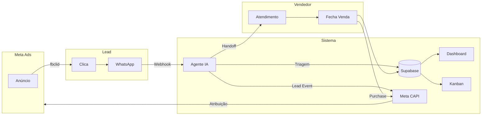

# 🗺️ Mapa de Funcionalidades - Loja do Monstrão

> **Cliente:** Loja do Monstrão
> **Segmento:** Moda Masculina (Varejo + Atacado)
> **Ciclo Shape Up:** 12 dias

---

## 1. Visão Geral

### 1.1 Problema a Resolver
**Vazamento de 75% dos leads** entre o clique no anúncio e o início da conversa no WhatsApp, resultando em R$ 60.000/mês de oportunidades perdidas.

### 1.2 Métricas de Sucesso
| KPI | Antes | Meta |
|-----|-------|------|
| Taxa de conversão clique→chat | 25% | 50%+ |
| Tempo de primeira resposta | > 5 min | < 30 seg |
| Leads rastreados por campanha | 0% | 100% |
| Follow-up de leads não convertidos | 0% | 80% |

---

## 2. MVP - 3 Módulos que Resolvem 80%

### 📊 Visão Visual da Solução


**Como funciona:**
- **Problema:** 75% dos cliques evaporam entre anúncio e WhatsApp
- **Solução em 3 Camadas:** Landing Page (+15%) + IA Instantânea (+10%) + Retargeting (+5%)
- **Resultado:** +120% de conversão (25% → 55%)

---

### 🤖 Módulo 1: Agente de IA de Triagem
**Objetivo:** Resposta instantânea + qualificação automática
**Usuário:** Lead que chega via WhatsApp

**Funcionalidades:**
- [x] Resposta automática em < 30 segundos
- [x] Saudação personalizada com nome do cliente
- [x] **Triagem: Atacado ou Varejo?** (pergunta direta)
- [x] Coleta de dados: Nome, Cidade, Interesse
- [x] Qualificação: Quente / Morno / Frio
- [x] Handoff para vendedor com contexto completo
- [x] Captura de `fbclid` para atribuição

**Fluxo de Conversa:**
```
LEAD: Oi
BOT: Olá! 👋 Bem-vindo à Loja do Monstrão!
     Sou o assistente virtual. Você está interessado em:
     
     1️⃣ Comprar para REVENDA (Atacado)
     2️⃣ Comprar para USO PRÓPRIO (Varejo)
     
     Digite 1 ou 2:

LEAD: 1
BOT: Ótimo! Atacado é com a gente! 💪
     Para te atender melhor, me diz:
     
     📍 Qual sua cidade?

LEAD: São Paulo
BOT: Perfeito! São Paulo tem frete especial 🚚
     
     👕 O que você mais procura?
     • Camisetas
     • Bermudas
     • Bonés
     • Conjuntos

LEAD: Camisetas
BOT: Anotado! ✅
     Vou chamar nosso especialista em atacado.
     Ele já vai te atender com os melhores preços!
     
     [HANDOFF → VENDEDOR]
     
     📋 CONTEXTO:
     • Nome: [aguardando]
     • Tipo: ATACADO
     • Cidade: São Paulo
     • Interesse: Camisetas
     • Campanha: {nome_campanha}
```

---

### 📊 Módulo 2: Dashboard de Atribuição
**Objetivo:** Saber exatamente qual anúncio gerou qual venda
**Usuário:** Dono / Gestor de Tráfego

**Funcionalidades:**
- [x] **Leads por Campanha** (gráfico de barras)
- [x] **Funil de Conversão** (clique → chat → venda)
- [x] **ROI por Anúncio** (custo vs receita)
- [x] **Ticket Médio por Fonte**
- [x] **Heatmap de Horários** (quando leads chegam)
- [x] Filtros: Período, Campanha, Vendedor
- [x] Atualização em tempo real (Supabase Realtime)

**Wireframe:**
```
┌─────────────────────────────────────────────────┐
│ 📊 DASHBOARD DE ATRIBUIÇÃO - Loja do Monstrão   │
├─────────────────────────────────────────────────┤
│ Período: [Hoje ▼]  Campanha: [Todas ▼]          │
├──────────────────┬──────────────────────────────┤
│                  │                              │
│  LEADS HOJE      │  FUNIL DE CONVERSÃO          │
│  ┌───────────┐   │  ████████████ 67 Cliques     │
│  │    47     │   │  ████████     35 Chats       │
│  │   leads   │   │  █████        18 Qualific.   │
│  └───────────┘   │  ███           8 Vendas      │
│                  │                              │
├──────────────────┴──────────────────────────────┤
│  LEADS POR CAMPANHA                             │
│  ┌──────────────────────────────────────────┐   │
│  │ Promo Verão      ████████████ 22 (47%)   │   │
│  │ Atacado Brasil   ██████████   18 (38%)   │   │
│  │ Remarketing      ███          7 (15%)    │   │
│  └──────────────────────────────────────────┘   │
├─────────────────────────────────────────────────┤
│  ROI POR ANÚNCIO (Últimos 7 dias)               │
│  ┌──────────────────────────────────────────┐   │
│  │ Anúncio       │ Custo  │ Receita │ ROI   │   │
│  │ Camiseta Polo │ R$ 200 │ R$ 2.400│ 12x   │   │
│  │ Bermuda Cargo │ R$ 150 │ R$ 800  │ 5.3x  │   │
│  │ Conjunto Full │ R$ 300 │ R$ 1.600│ 5.3x  │   │
│  └──────────────────────────────────────────┘   │
└─────────────────────────────────────────────────┘
```

---

### 📋 Módulo 3: CRM Kanban
**Objetivo:** Gestão de follow-up para leads não convertidos
**Usuário:** Vendedor / Gerente

**Funcionalidades:**
- [x] **Kanban Drag-and-Drop** (5 colunas)
- [x] Card com info do lead (nome, tipo, interesse, campanha)
- [x] **Lembrete de Follow-up** (notificação WhatsApp)
- [x] Histórico de interações
- [x] Tags: Quente, Morno, Frio, Atacado, Varejo
- [x] Filtros por vendedor, tag, data

**Estágios do Kanban:**
```
┌──────────┬──────────┬──────────┬──────────┬──────────┐
│   NOVO   │QUALIFICAD│NEGOCIANDO│  FECHADO │ PERDIDO  │
│   (15)   │   (8)    │   (5)    │   (12)   │   (7)    │
├──────────┼──────────┼──────────┼──────────┼──────────┤
│┌────────┐│┌────────┐│┌────────┐│┌────────┐│┌────────┐│
││João    ││Maria   ││Pedro   ││Ana     ││Carlos  ││
││ATACADO ││VAREJO  ││ATACADO ││VAREJO  ││ATACADO ││
││SP      ││RJ      ││MG      ││SP      ││BA      ││
││Promo   ││Remarke ││Atacado ││Promo   ││Promo   ││
│└────────┘│└────────┘│└────────┘│└────────┘│└────────┘│
│┌────────┐│┌────────┐│          │┌────────┐│          │
││...     ││...     ││          ││...     ││          │
│└────────┘│└────────┘│          │└────────┘│          │
└──────────┴──────────┴──────────┴──────────┴──────────┘
```

---

## 3. Fluxo Completo



---

## 4. Backlog Futuro (Pós-MVP)

| Funcionalidade | Prioridade | Ciclo |
|----------------|------------|-------|
| Catálogo de produtos no chat | Alta | Ciclo 2 |
| Pagamento PIX no WhatsApp | Alta | Ciclo 2 |
| Automação de follow-up (drip) | Média | Ciclo 2 |
| Relatórios BI exportáveis | Média | Ciclo 3 |
| Multi-atendente com fila | Média | Ciclo 3 |
| Integração com ERP | Baixa | Ciclo 4 |

---

## 5. O Que NÃO Entra no MVP

> **Scope Creep Prevention**

- ❌ Catálogo de produtos (complexidade extra)
- ❌ Pagamento no chat (exige integração PIX)
- ❌ Multi-atendente (MVP é 1 número)
- ❌ Relatórios exportáveis (dashboard basta)
- ❌ Integração com ERP existente

**Justificativa:** O problema central é **atribuição + velocidade de resposta**. Tudo que não resolve isso diretamente fica para depois.

---

## 6. Cronograma Shape Up (12 dias)

| Semana | Dias | Entrega |
|--------|------|---------|
| S1 | D1-D2 | Setup: Supabase + Evolution + Webhook |
| S1 | D3-D5 | Agente IA: Triagem + Qualificação |
| S2 | D6-D8 | Meta CAPI: Eventos Lead + Purchase |
| S2 | D9-D10 | Dashboard de Atribuição |
| S2 | D11-D12 | CRM Kanban + Testes + Deploy |

---

## 7. Critérios de Aceite

- [ ] Agente responde em < 30 segundos
- [ ] Lead rastreado com `fbclid` ou campanha
- [ ] Evento `Lead` enviado ao Meta CAPI
- [ ] Evento `Purchase` enviado ao fechar venda
- [ ] Dashboard mostra leads por campanha
- [ ] Kanban permite mover leads entre estágios
- [ ] Vendedor recebe contexto completo no handoff

---
*Gerado por CodeSprint AI Architect*
