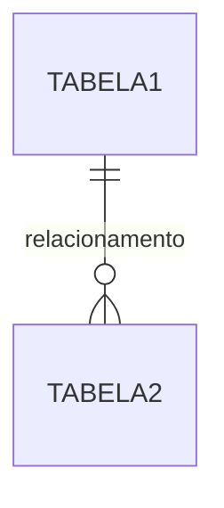
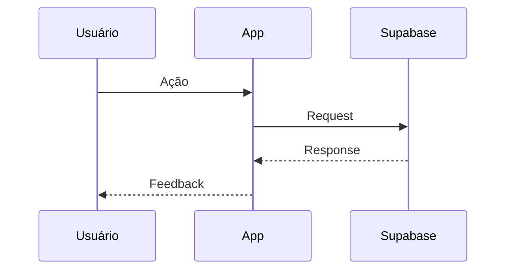

# 🏗️ Arquitetura Técnica

> **Cliente:** [NOME]
> **Data:** [DATA]
> **Stack:** React + Supabase + PWA

---

## 1. Stack Tecnológica

| Camada | Tecnologia | Justificativa |
|--------|------------|---------------|
| **Frontend** | React + TailwindCSS | Componentização + Utility-first |
| **Backend** | Supabase (Postgres) | BaaS completo + Realtime |
| **Auth** | Supabase Auth | WhatsApp + Magic Link |
| **Offline** | PWA + IndexedDB | Funcionamento sem internet |

---

## 2. Modelo de Dados

### 2.1 Diagrama ER



### 2.2 Tabelas Principais

#### `tabela_1`
| Coluna | Tipo | Descrição |
|--------|------|-----------|
| id | uuid | PK |
| created_at | timestamptz | Data criação |

---

## 3. Fluxos de Dados

### 3.1 Fluxo Principal



---

## 4. Estratégia Offline-First

### 4.1 Cenário Sem Internet
[Como o sistema se comporta]

### 4.2 Sincronização
[Estratégia de sync quando voltar online]

---

## 5. UX/UI Guidelines

### 5.1 Mobile-First
- [ ] Botões grandes (min 48px)
- [ ] Feedback visual exagerado
- [ ] Thumb Zone otimizada

### 5.2 Cores e Feedback
| Estado | Cor | Feedback |
|--------|-----|----------|
| Sucesso | Verde | Tela cheia + Som |
| Erro | Vermelho | Vibração + Mensagem |
| Loading | Azul | Spinner |

---

## 6. Segurança (RLS)

```sql
-- Exemplo de política RLS
CREATE POLICY "policy_name" ON tabela
FOR SELECT USING (auth.uid() = user_id);
```

---
*Gerado por CodeSprint AI Architect*
